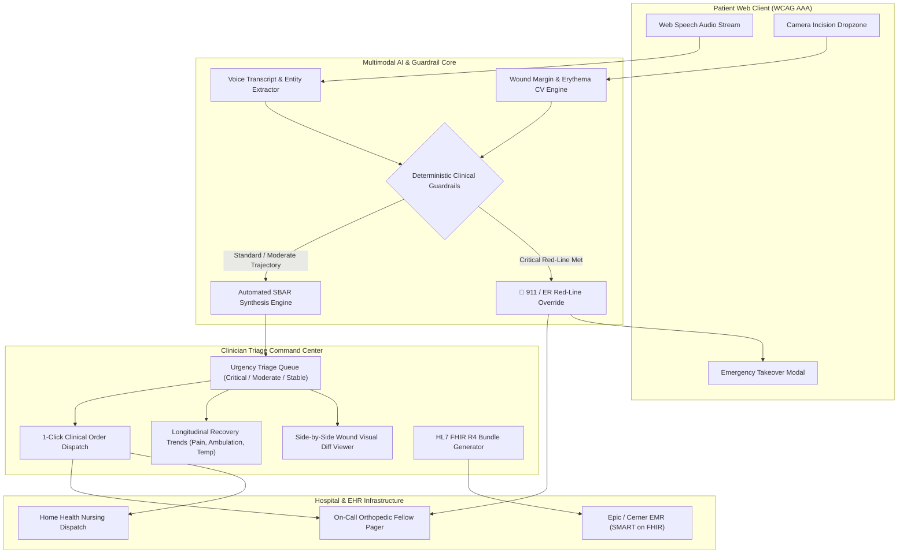

# PatientVoice: Ambient Post-Op Recovery & Symptom Escalation Assistant

> **AI Builders Hackathon 2026 Submission**  
> *Track: Problem Solving & Real-World Impact • Technical Implementation • Innovation & Healthcare Agent Architecture*

---

## 🌟 Executive Summary

**PatientVoice** is an ambient clinical agent designed to dramatically reduce hospital readmissions and surgical complications following orthopedic surgery (Total Knee Arthroplasty / Total Hip Arthroplasty). 

Post-discharge care currently suffers from a massive communication gap: elderly patients struggle with cumbersome 30-question web portals, while subtle life-threatening complications (e.g., Deep Vein Thrombosis, early Surgical Site Infections, medication non-adherence due to opioid nausea) go undetected until the patient arrives in the Emergency Department.

PatientVoice closes this gap through:
1. **Accessible Ambient Voice Check-Ins (<90s)**: High-contrast (WCAG AAA compliant), friction-free voice interface that transcribes speech, extracts clinical metrics (pain scale 0-10, mobility, ambulation feet, medication adherence), and provides empathetic verbal guidance.
2. **Computer-Vision Incision Analysis**: Automated erythema perimeter mapping (measuring mm expansion from Day 0 baseline), surgical staple approximation checks, and purulent exudate detection.
3. **Deterministic Clinical Guardrail Engine**: Eliminates probabilistic LLM hallucination risks by synchronously evaluating safety red-lines (Wells Score DVT criteria, Pulmonary Embolism dyspnea, SIRS pyrexia ≥ 101.5°F, dehiscence ≥ 5mm), instantly executing 911/ER overrides.
4. **Clinician Triage Command Center**: Dense, action-oriented dashboard for on-call orthopedic nurses and fellows featuring real-time risk queue sorting, side-by-side wound visual diffs, longitudinal recovery biomarkers, automated SBAR clinical notes, 1-click order dispatches, and **HL7® FHIR® R4 ClinicalImpression** JSON exports.

---

## 🏗️ System Architecture



---

## 🧪 Synthetic Clinical Test Profiles (Sandbox Presets)

The system is pre-seeded with 4 realistic clinical archetypes representing key post-op recovery trajectories:

| Patient Profile | Demographics & Surgery | Recovery Scenario & Findings | Triage Classification | Clinical Disposition |
| :--- | :--- | :--- | :--- | :--- |
| **Eleanor Vance** | 71F • Day 3 Post-Op TKA | **Normal Recovery**: Pain 3/10 (decreasing), walking 160ft with walker, afebrile (98.6°F), incision clean & dry, full Eliquis adherence. | 🟢 **STABLE** | Continue scheduled home physical therapy. |
| **Marcus Sterling** | 58M • Day 4 Post-Op THA | **Early Surgical Site Infection (SSI)**: Erythema halo expanded to 28mm (+24mm vs baseline), purulent drainage on dressing, low-grade fever 100.8°F, pain rising to 6/10. | 🟡 **MODERATE** | Same-day wound clinic review & wound culture. |
| **Robert Chen** | 66M • Day 5 Post-Op TKA | **Critical Thromboembolic Emergency**: Unilateral calf edema (+3.5cm), acute pain (8/10), dyspnea upon walking 20ft, SpO2 93%, tachycardia (HR 104). | 🔴 **CRITICAL** | **Instant 911 / ER Bypass**: Direct STAT Doppler US & Fellow page. |
| **Brenda Miller** | 62F • Day 2 Post-Op THA | **Medication Non-Adherence & Breakthrough Pain**: Intractable post-op opioid nausea preventing ingestion of Eliquis blood thinner & pain meds, pain 8/10, bedbound. | 🟡 **MODERATE** | Tele-triage call; prescribe dissolvable Ondansetron ODT & revise analgesic. |

---

## 💻 Tech Stack

- **Framework**: [Next.js 14 (App Router)](https://nextjs.org/)
- **Language**: TypeScript (Strict Mode)
- **Styling**: Tailwind CSS + Custom Clinical Theme Tokens
- **Icons**: [Lucide React](https://lucide.dev/)
- **Audio & Multimodal**: Web Speech API, HTML5 Canvas Live Waveform Visualizer, Web Audio API Sound Synthesizer
- **Interoperability**: HL7® FHIR® R4 (`ClinicalImpression`, `Patient`, `Observation`, `Bundle`) mapped to SNOMED CT and LOINC ontologies
- **Accessibility**: WCAG 2.1 AAA Compliant high-contrast modes, font scale toggles (100%-150%), audio speech synthesis prompts

---

## 🚀 Quick Start & Local Execution

### 1. Installation
```bash
# Clone repository
git clone https://github.com/ai-builders/patientvoice-postop-assistant.git
cd patientvoice-postop-assistant

# Install dependencies
npm install
```

### 2. Development Server
```bash
npm run dev
```
Open [http://localhost:3000](http://localhost:3000) (or `http://localhost:3001` if port 3000 is occupied).

### 3. Production Build & Verification
```bash
npm run build
npm run start
```

---

## 🔌 API Endpoint Documentation

| Method | Endpoint | Description | Sample Payload / Response |
| :--- | :--- | :--- | :--- |
| `POST` | `/api/checkin/voice` | Ingests speech transcript & vitals, evaluates guardrails, updates recovery state. | `{"patientId": "pt-103", "transcript": "My calf is swollen and tight...", "vitals": {"temperatureF": 99.4}}` |
| `POST` | `/api/checkin/vision` | Ingests wound photo, computes erythema margin (mm) and exudate status. | `{"image": "/images/wounds/hip-infection-erythema.svg", "patientArchetype": "INFECTION"}` |
| `GET` | `/api/clinician/patients` | Returns active triage cohort sorted by urgency priority (Critical → Moderate → Stable). | Returns `{ patients: [...], summary: { criticalCount: 1, ... } }` |
| `POST` | `/api/clinician/resolve` | Logs clinician intervention order and updates alert status. | `{"patientId": "pt-102", "actionType": "DISPATCH_HOME_HEALTH", "notes": "RN dispatched"}` |
| `GET` | `/api/patient/[id]/fhir` | Exports standard HL7 FHIR R4 ClinicalImpression Bundle. | Returns `application/fhir+json` Bundle resource |

---

## ⚖️ Deterministic Guardrails Decision Matrix

| Clinical Trigger Condition | Clinical Rationale & Ontological Reference | Deterministic Safety Action |
| :--- | :--- | :--- |
| **Calf Pain / Swelling** | Wells DVT Score criteria (+3.5cm unilateral calf edema) | **CRITICAL OVERRIDE**: Direct ER / 911 dispatch. STAT Bilateral Venous Duplex. |
| **Chest Pain / SOB** | High post-arthroplasty Pulmonary Embolism risk | **CRITICAL OVERRIDE**: Immediate 911 call. STAT CTA Chest. |
| **Core Temp ≥ 101.5°F** | SIRS Criteria / Prosthetic Joint Infection (PJI) | **URGENT SURGICAL**: Urgent clinic evaluation, blood cultures, joint aspiration. |
| **Dehiscence ≥ 5mm** | Acute surgical site wound gaping | **URGENT SURGICAL**: On-call fellow evaluation, sterile dressing protocol. |
| **Erythema ≥ 20mm or Purulence** | CDC Surgical Site Infection (SSI) criteria | **MODERATE ESCALATION**: Same-day wound clinic review, wound culture, oral antibiotics. |
| **Pain ≥ 8/10 or Missed Anticoagulant** | Break in thromboembolic prophylaxis / opioid emesis | **NURSE TRIAGE**: 1-hour callback, dissolvable anti-emetic, analgesic revision. |
